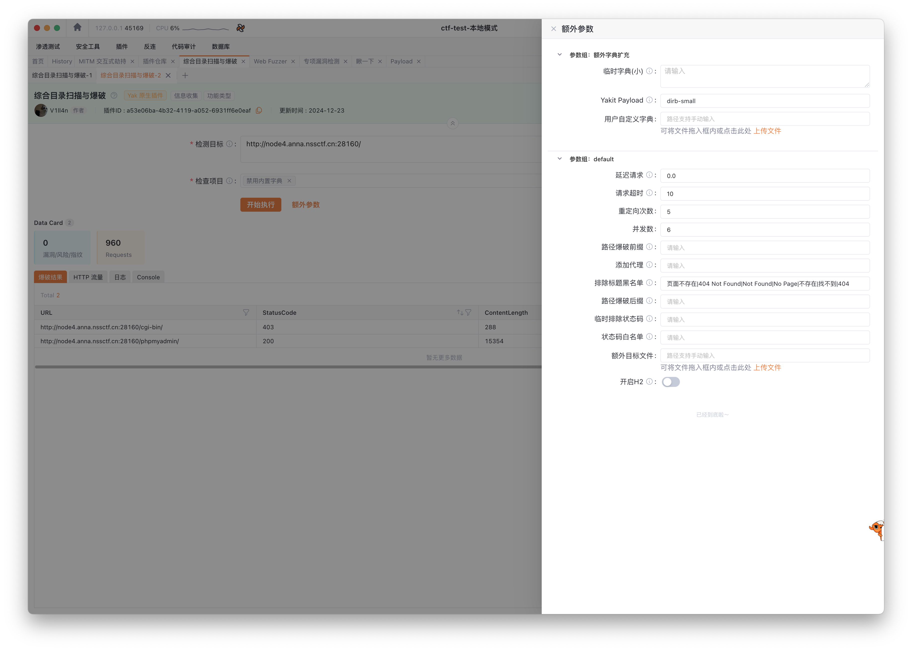

## 基本信息

- 题目名称： [第五空间 2021]yet_another_mysql_injection
- 题目链接： https://www.nssctf.cn/problem/334
- 考点清单： quine注入, unique注入, SQL注入, WAF绕过, 源码审计
- 工具清单： Yakit, sqlmap, mysql, adminer
- payloads： 敏感文件爆破, robots.txt, quine

## 一、看到什么

### 第一轮

**题目关键信息列表**：

1. `登录表单`: 最基本的登录表单，包括用户名和密码输入框。
2. `HTTP 响应`: Apache/2.4.29 (Ubuntu)，无其他线索信息。
3. `页面源代码`: 审计发现代码注释中包含线索 `<!-- /?source -->`

## 二、想到什么解题思路

### 第一轮

1. `页面源代码`: 访问 /?source ，查看源码。
2. 目录爆破，找其他可能攻击入口。

## 三、尝试过程和结果记录

### 第一轮

1. `页面源代码`: 访问 /?source ，查看源码。注释代码为我自己分析后添加。

```php
<?php
include_once("lib.php");
function alertMes($mes,$url){
    die("<script>alert('{$mes}');location.href='{$url}';</script>");
}

function checkSql($s) {
    if(preg_match("/regexp|between|in|flag|=|>|<|and|\||right|left|reverse|update|extractvalue|floor|substr|&|;|\\\$|0x|sleep|\ /i",$s)){ // sql 注入黑名单关键词，需要绕过
        alertMes('hacker', 'index.php');
    }
}

if (isset($_POST['username']) && $_POST['username'] != '' && isset($_POST['password']) && $_POST['password'] != '') {
    $username=$_POST['username'];
    $password=$_POST['password'];
    if ($username !== 'admin') {
        alertMes('only admin can login', 'index.php');
    }
    checkSql($password);
    $sql="SELECT password FROM users WHERE username='admin' and password='$password';"; // SQL 注入点
    $user_result=mysqli_query($con,$sql);
    $row = mysqli_fetch_array($user_result);
    if (!$row) {
        alertMes("something wrong",'index.php');
    }
    if ($row['password'] === $password) {
        die($FLAG);
    } else {
    alertMes("wrong password",'index.php');
  }
}

if(isset($_GET['source'])){
  show_source(__FILE__);
  die;
}
?>
<!-- /?source -->
<html>
    <body>
        <form action="/index.php" method="post">
            <input type="text" name="username" placeholder="账号"><br/>
            <input type="password" name="password" placeholder="密码"><br/>
            <input type="submit" / value="登录">
        </form>
    </body>
</html>
```

直接使用 [hdctf2023-loginmaster](hdctf2023-loginmaster.md) 中的 `payload` 直接通关拿到 `FLAG` 。


2. 目录爆破，写 WP 查资料的时候发现别人有提到还有 `/phpmyadmin` 未预期后门。经验证，后门文件虽然存在，但是已经无法使用该后门。疑似 phpmyadmin 相关请求被 WAF 拦截限制。



## 四、总结与反思

- `Quine 注入 payload` 看来复用性很高，可以尝试在其他题目中快速验证使用。


