# 2024长城杯&CISCN-威胁流量分析-zeroshell · 玄机 - EDISEC https://xj.edisec.net/challenges/104

- 考点清单：流量分析、电子取证
- 工具清单: wireshark、ghidra

>小路是一名实习生，接替公司前任网管的工作，一天发现公司网络出口出现了异常的通信，现需要通过回溯出口流量对异常点位(防火墙)进行定位，并确定异常的设备。然后进行深度取证检查（需要获取root权限）。现在需要你从网络攻击数据包中找出漏洞攻击的会话，分析会话编写exp或数据包重放获取防火墙设备管理员权限，查找防火墙设备上安装的木马，然后分析木马外联地址和通信密钥以及木马启动项位置。

## 第一问：

>从数据包中找出攻击者利用漏洞开展攻击的会话（攻击者执行了一条命令），写出该会话中设置的flag, 结果提交形式：flag{xxxxxxxxx}

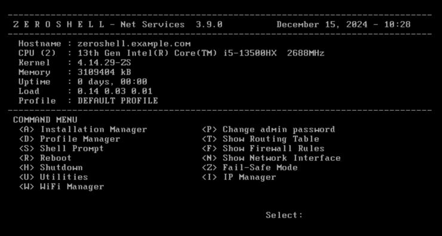

发现该防火墙版本是zeroshell 3.9.0,直接在谷歌查找


发现该漏洞的验证poc如下：

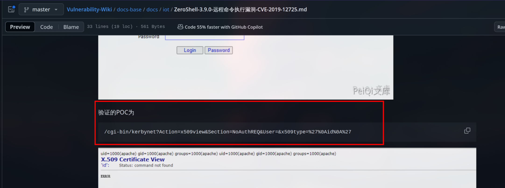

在流量包中找到了该验证过程，但没有flag

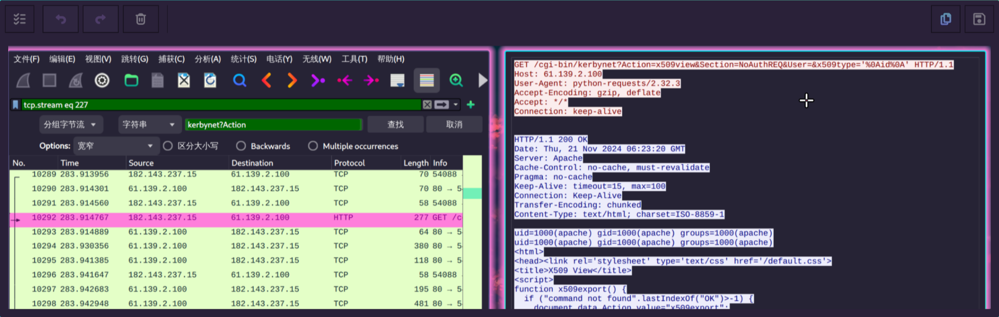

继续查看其他流发现请求头的Referer中有一段base64编码

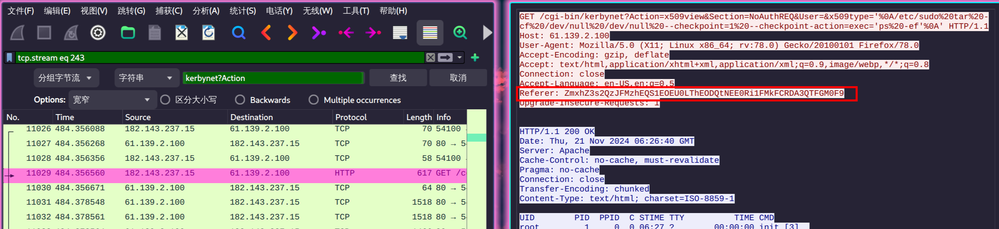

base64解码得：

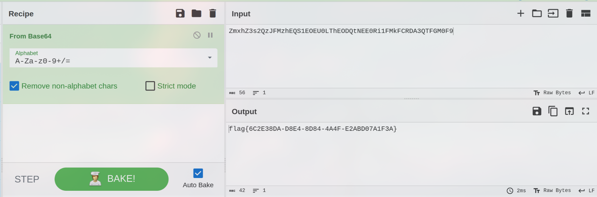

### flag值

flag{6C2E38DA-D8E4-8D84-4A4F-E2ABD07A1F3A}

## 第二问：

>通过漏洞利用获取设备控制权限，然后查找设备上的flag文件，提取flag文件内容，结果提交形式：flag{xxxxxxxxxx}

题目说让我们通过利用漏洞获得设备控制权限，可以向服务器直接发送反弹shell，但是也可以直接在命令注入点直接进行获取flag的操作

```bash
find%20/%20-name%20flag
```

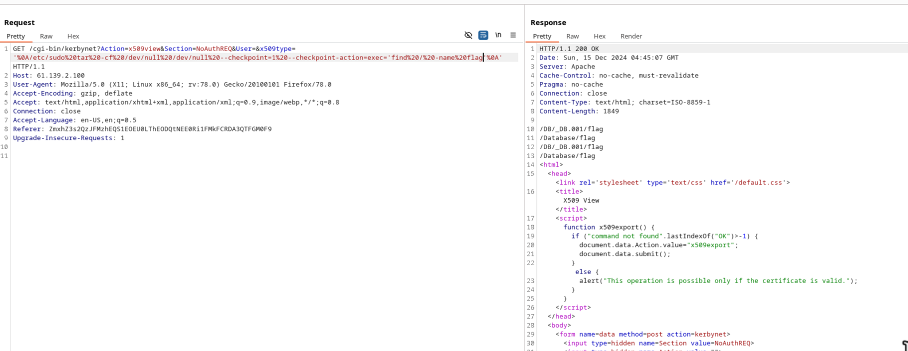

```bash
cat%20/Database/flag
```

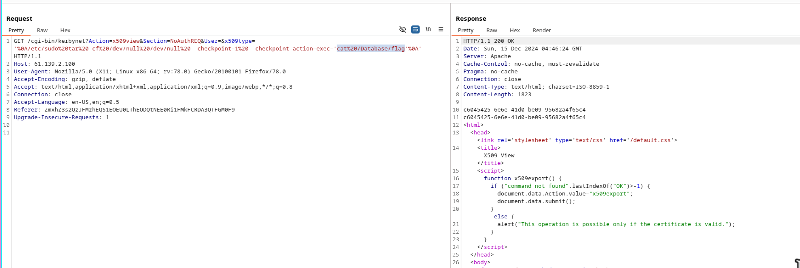

### flag值

flag{c6045435-6e6e-41d0-be09-95682a4f65c4}

## 第三问：

>找出受控机防火墙设备中驻留木马的外联域名或IP地址，结果提交形式：flag{xxxx}，如flag{www.abc.com} 或 flag{16.122.33.44}

查看

```bash
netstat%20-anop
```

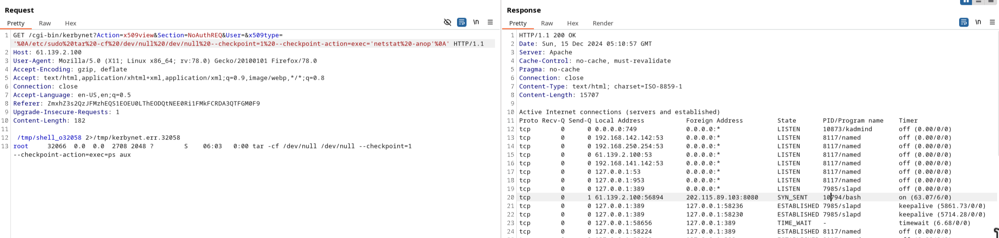 

### flag值

flag{202.115.89.103}

## 第四问：

>请写出木马进程执行的本体文件的名称，结果提交形式：flag{xxxxx}，仅写文件名不加路径

同上，利用漏洞poc，通过第三问获得的木马外连网络通信的进程号来获得木马进程执行的本地文件
```bash
ls%20-l%20/proc/10794%20%7C%20grep%20exe
```

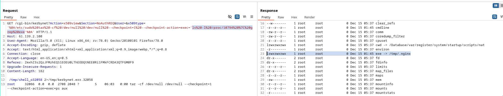

### flag值

flag{.nginx}

## 第五问：

>请提取驻留的木马本体文件，通过逆向分析找出木马样本通信使用的加密密钥，结果提交形式：flag{xxxx}

同上，利用漏洞poc提取木马本体文件

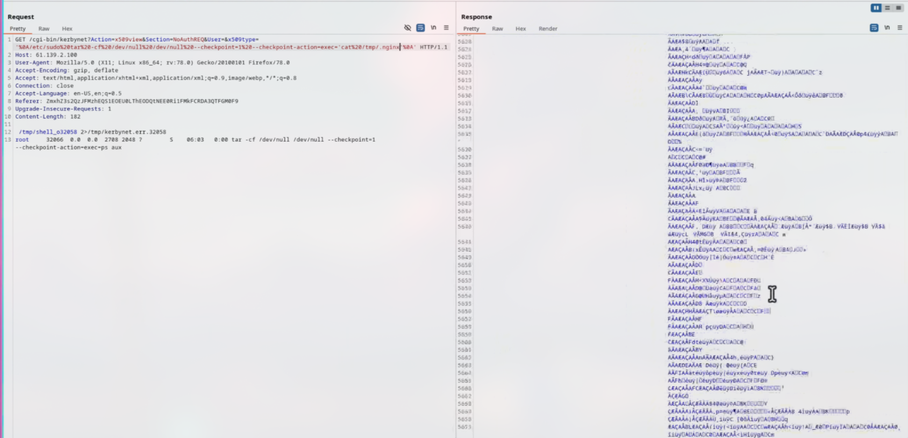

将报文中的文件导出成elf文件，使用srtings打印可打印字符后发现有一行是反连的IP地址，第二行猜想就是密钥，尝试，通过


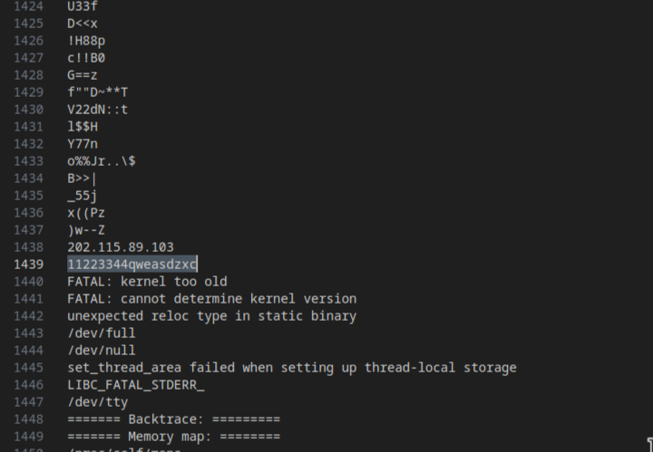

此外，也可以通过逆向分析elf文件的反连地址来获得flag

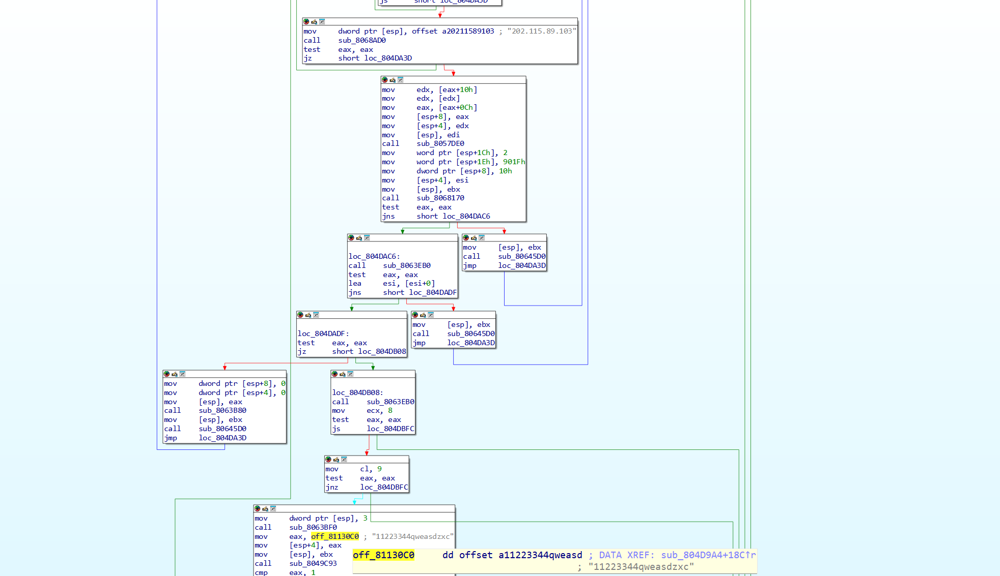

### flag值

flag{11223344qweasdzxc}

## 第六问：

>请写出驻留木马的启动项，注意写出启动文件的完整路径。结果提交形式：flag{xxxx}，如flag{/a/b/c}

运行.nginx之后在/tmp会有循环进程保活，那么就会引用到.nginx，利用grep搜索之后可以看到保活脚本(最后在/var找到了)`grep -r “.nginx” /var`

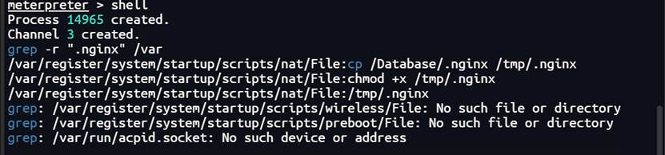

### flag值：
flag{/var/register/system/startup/scripts/nat/File}