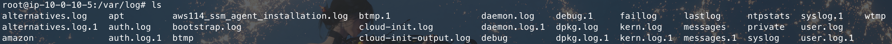
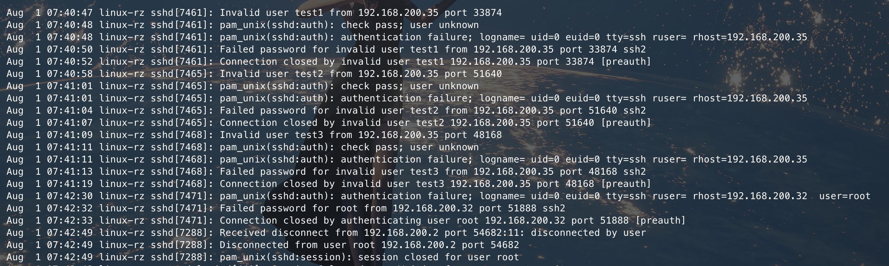
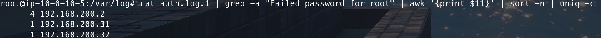
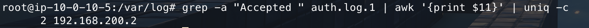
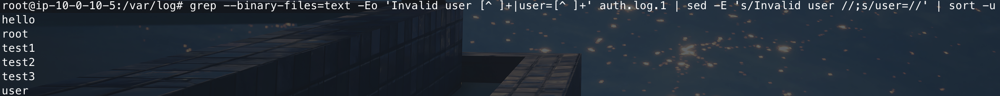
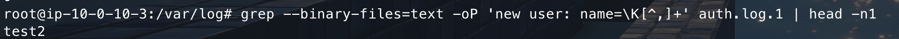

# 第一章 应急响应-Linux日志分析 · 玄机 - EDISEC https://xj.edisec.net/challenges/24

- 考点清单：应急响应、日志分析

题目信息：

>**账号root密码linuxrz  
>ssh root@IP  
>1.有多少IP在爆破主机ssh的root帐号，如果有多个使用","分割  
>2.ssh爆破成功登陆的IP是多少，如果有多个使用","分割  
>3.爆破用户名字典是什么？如果有多个使用","分割  
>4.登陆成功的IP共爆破了多少次  
>5.黑客登陆主机后新建了一个后门用户，用户名是多少**

## 1.有多少IP在爆破主机ssh的root帐号，如果有多个使用","分割

启动环境后，使用ssh连接到靶机，因为题目是要起看多少IP在爆破主机ssh的root账号，所以我们可以直接去看对应的日志，日志路径在`/var/log/`下

我们可以看到有如下日志：



那么哪个日志是我们需要的呢？

一些常见的Linux日志文件：

| 日志文件        | 说明                                    |
|:-------------:|:--------------------------------------:|
| auth.log      | 记录系统认证相关信息，如用户登录、sudo使用等         |
| auth.log.1    | auth.log的历史归档日志                     |
| btmp          | 记录失败的登录尝试，二进制文件，用`lastb`命令查看    |
| lastlog       | 记录所有用户最近一次登录时间，二进制文件           |
| messages      | 记录系统常规信息和错误信息，排错重要日志           |
| syslog        | 记录系统级信息，包括启动、服务、内核等            |

所以我们可以去看一下`auth.log.1`的内容



其实我们要是一个一个看的话也可以看出来，但是可以通过更优雅的方式来获得对应的flag

```bash
cat auth.log.1 | grep -a "Failed password for root" | awk '{print $11}' | sort -n | uniq -c
```



## 2.ssh爆破成功登陆的IP是多少，如果有多个使用","分割

这里和上一道题其实一样，只不过找的是成功的ip，依旧用一个优雅的命令来获得

```bash
grep -a "Accepted " auth.log.1 | awk '{print $11}' | uniq -c
```



## 3.爆破用户名字典是什么？如果有多个使用","分割

同样，用命令读文件获得

```bash
grep --binary-files=text -Eo 'Invalid user [^ ]+|user=[^ ]+' auth.log.1 | sed -E 's/Invalid user //;s/user=//' | sort -u
```



## 4.登陆成功的IP共爆破了多少次

从1里我们也可以看出来是4次，所以flag是4（虽然其实我用别的命令得出总的尝试登陆次数比4次多，但是答案是4次，我也很疑惑，可能是因为这里要得的是爆破root登陆次数且失败的？）

## 5.黑客登陆主机后新建了一个后门用户，用户名是多少

```bash
grep --binary-files=text -oP 'new user: name=\K[^,]+' auth.log.1 | head -n1
```

