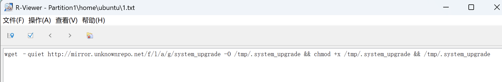
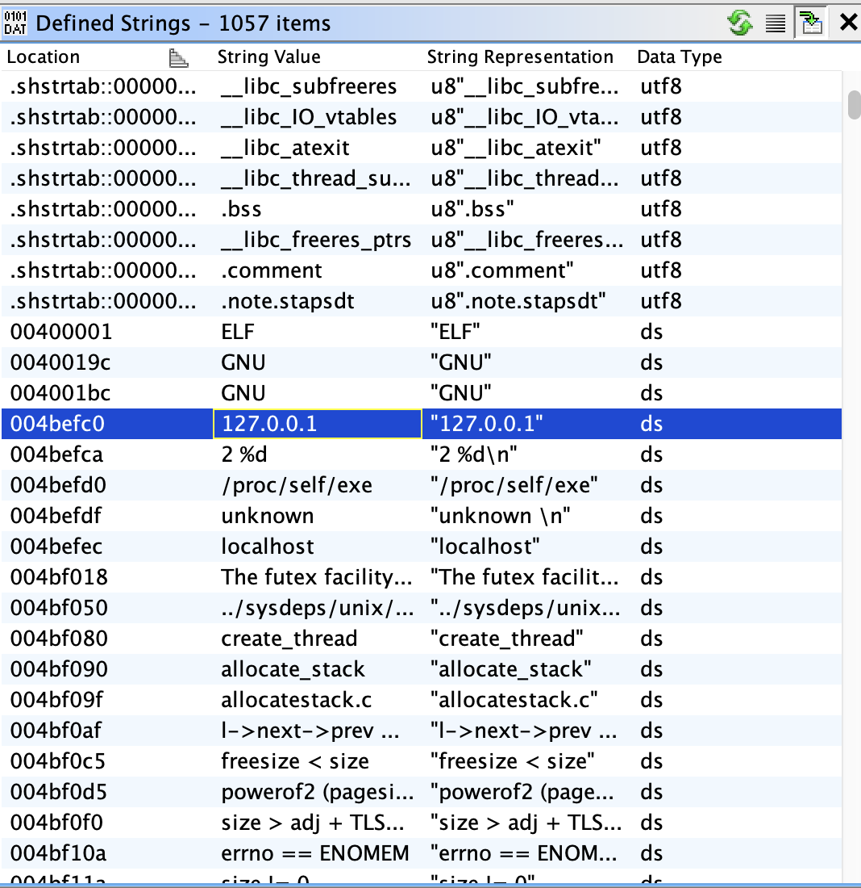
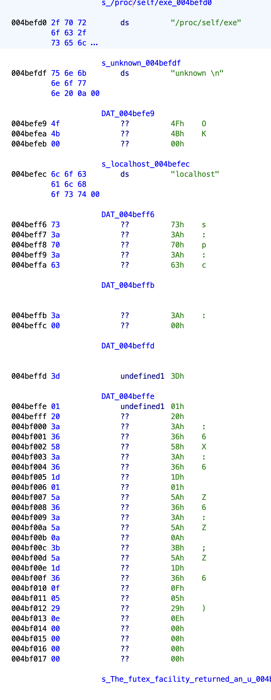

# 第二届长城杯&CISCN半决赛-应急响应 · 玄机 - EDISEC https://xj.edisec.net/challenges/117

- 考点清单：应急响应，电子取证，逆向分析
- 工具清单：R-studio、ghidra或IDA

## 第一问：

>找出主机上木马回连的主控端服务器IP地址[不定时(3~5分钟)周期性]，并以flag{MD5}形式提交，其中MD5加密目标的原始字符串格式IP:port。

这一道题有三种解法
- 接地气（靠运气但确实能解，不太聪明的解法）：因为题目说不定时木马会回连主控端服务器IP地址，那么我们就在提供的服务器中专门去监听所有端口的网络通信（碰运气，能查到）
- 较为聪明的解法：在服务器中直接抓网卡的包，使用`tcpdump`将所有流量进行监听，然后查看流量包即可获得对应的IP和port
- 题目预期解：
	- 使用`r-studio`或者其他取证工具打开下载的附件文件，发现在`/home/ubuntu`路径下有一个被删除的`1.txt`的文件，查看文件内容得到木马文件的地址，可以在工具里下载下来，或者wget命令下载下来，进行分析，获得反连IP，同时也可以从`.viminfo`中看到一些可疑的信息，有一个`systemd`的服务，查看该文件内容，导出与之对应的文件后逆向分析得到反连的IP地址和端口



```txt
# File marks:
'0  6  0  /etc/systemd/system/system-upgrade.service
|4,48,6,0,1740374317,"/etc/systemd/system/system-upgrade.service"
'1  6  0  /etc/systemd/system/system-upgrade.service
|4,49,6,0,1740374161,"/etc/systemd/system/system-upgrade.service"
'2  5  7  /etc/systemd/system/system-upgrade.service
|4,50,5,7,1740374151,"/etc/systemd/system/system-upgrade.service"
'3  5  7  /etc/systemd/system/system-upgrade.service
|4,51,5,7,1740374151,"/etc/systemd/system/system-upgrade.service"
'4  5  7  /etc/systemd/system/system-upgrade.service
|4,52,5,7,1740374151,"/etc/systemd/system/system-upgrade.service"
'5  5  7  /etc/systemd/system/system-upgrade.service
|4,53,5,7,1740374151,"/etc/systemd/system/system-upgrade.service"
```

```systemd.service
[Unit]  
Description=system-upgrade  
After=multi-user.target  
[Service]  
Type=forking  
ExecStart=/sbin/insmod /lib/modules/5.4.0-84-generic/kernel/drivers/system/system-upgrade.ko  
[Install]  
WantedBy=multi-user.target
```

逆向`system-upgrade.ko`文件，找到`strings`窗口，发现有一个IP是`192.168.57.203`，然后可以找到文件的主体函数，虽然反汇编后得到的是经过混淆的伪代码，但还是通过分析逻辑来获得一些有用可靠的信息

```c
void ULRYvXzICzy880dO(void)

{
  Cr8YeLCPy17g2Kqp();
  vH5iRF4rBcsPSxfk();
  QODpPLbPPLRtk397();
  ZRzAVZZOp3EIPba6(&DAT_00102750);
  XnzbhEaPnydxn1rY("HIDEME",ZRzAVZZOp3EIPba6);
  XnzbhEaPnydxn1rY("SHOWME",bbiVzCN8llELLp6o);
  XnzbhEaPnydxn1rY("HIDE_DENT",Fmk3MFLuFCEiNxgN);
  XnzbhEaPnydxn1rY("SHOW_HIDDEN_DENT",PiCa2rGqFOVs1eiB);
  XnzbhEaPnydxn1rY("HIDE_TCP_PORT",IDZO4NzptW8GaHzj);
  XnzbhEaPnydxn1rY("SHOW_HIDDEN_TCP_PORT",ol186ifyeUPhXKNl);
  XnzbhEaPnydxn1rY("HIDE_TCP_IP",H7XMCPIhJup38DuP);
  XnzbhEaPnydxn1rY("SHOW_HIDDEN_TCP_IP",yiA2lg0kW8v2vOp0);
  XnzbhEaPnydxn1rY("HIDE_UDP_PORT",cuC5zWc4iL4kPgAn);
  XnzbhEaPnydxn1rY("SHOW_HIDDEN_UDP_PORT",LC22j9OZfANw81M7);
  XnzbhEaPnydxn1rY("HIDE_UDP_IP",YlfqRhWLKVqMFbxN);
  XnzbhEaPnydxn1rY("SHOW_HIDDEN_UDP_IP",XBKrkXaghfenXrk6);
  XnzbhEaPnydxn1rY("BINDSHELL_CREATE",NVEKPqx35kIvfacV);
  XnzbhEaPnydxn1rY("RUN_CUSTOM_BASH",T34Z94ahif0BXQRk);
  Fmk3MFLuFCEiNxgN("systemd-agentd");
  Fmk3MFLuFCEiNxgN("system-upgrade");
  Fmk3MFLuFCEiNxgN("system_upgrade");
  IDZO4NzptW8GaHzj(&DAT_0010284c);
  IDZO4NzptW8GaHzj(&DAT_00102851);
  H7XMCPIhJup38DuP("192.168.57.203");
  H7XMCPIhJup38DuP("127.0.0.1");
  cuC5zWc4iL4kPgAn(&DAT_00102865);
  YlfqRhWLKVqMFbxN("127.0.0.1");
  return;
}
```

上面部分是ghidra的反汇编分析结果，我们使用ghidra的话也可以深入对函数进行交叉调用分析来获得通信的端口号，但若是用ida反汇编的话可以直接得出端口

```c
__int64 __fastcall ULRYvXzICzy880dO(__int64 a1)
{
    _fentry__(a1);
    Cr8YeLCPy17g2Kqp(a1);
    vH5iRF4rBcsPSxfk(a1);
    QODpPLbPPLRtk397(a1);
    ZRzAVZZOp3EIPba6();
    XnzbhEaPnydxn1rY((__int64)"HIDEME", (__int64)ZRzAVZZOp3EIPba6);
    XnzbhEaPnydxn1rY((__int64)"SHOWME", (__int64)bbiVzCN8llELLp6o);
    XnzbhEaPnydxn1rY((__int64)"HIDE_DENT", (__int64)Fmk3MFLuFCEiNxgN);
    XnzbhEaPnydxn1rY((__int64)"SHOW_HIDDEN_DENT", (__int64)PiCa2rGqFOVs1eiB);
    XnzbhEaPnydxn1rY((__int64)"HIDE_TCP_PORT", (__int64)IDZO4NzptW8GaHzj);
    XnzbhEaPnydxn1rY((__int64)"SHOW_HIDDEN_TCP_PORT", (__int64)ol186ifyeUPhXKNl);
    XnzbhEaPnydxn1rY((__int64)"HIDE_TCP_IP", (__int64)H7XMCPIhJup38DuP);
    XnzbhEaPnydxn1rY((__int64)"SHOW_HIDDEN_TCP_IP", (__int64)yiA2lg0kW8v2vOp0);
    XnzbhEaPnydxn1rY((__int64)"HIDE_UDP_PORT", (__int64)cuC5zWc4iL4kPgAn);
    XnzbhEaPnydxn1rY((__int64)"SHOW_HIDDEN_UDP_PORT", (__int64)LC22j9OZfANw81M7);
    XnzbhEaPnydxn1rY((__int64)"HIDE_UDP_IP", (__int64)YlfqRhWLKVqMFbxN);
    XnzbhEaPnydxn1rY((__int64)"SHOW_HIDDEN_UDP_IP", (__int64)XBKrkXaghfenXrk6);
    XnzbhEaPnydxn1rY((__int64)"BINDSHELL_CREATE", (__int64)NVEKPqx35kIvfacV);
    XnzbhEaPnydxn1rY((__int64)"RUN_CUSTOM_BASH", (__int64)T34Z94ahif0BXQRk);
    Fmk3MFLuFCEiNxgN("systemd-agentd");
    Fmk3MFLuFCEiNxgN("system-upgrade");
    Fmk3MFLuFCEiNxgN("system_upgrade");
    IDZO4NzptW8GaHzj("4948");
    IDZO4NzptW8GaHzj("1337");
    H7XMCPIhJup38DuP("192.168.57.203");
    H7XMCPIhJup38DuP("127.0.0.1");
    cuC5zWc4iL4kPgAn("8080");
    return YlfqRhWLKVqMFbxN("127.0.0.1");
}
```

- `system-upgrade` 位于 `/lib/modules/5.4.0-84-generic/kernel/drivers/system/system-upgrade.ko`
- `systemd-agentd` 位于 `/lib/systemd/systemd-agentd`

```txt
192.168.57.203:4948
```

## 第二问：

>找出主机上驻留的远控木马文件本体，计算该文件的MD5, 结果提交形式： flag{md5}

对第一问中得到的`systemd-agentd`找到文件路径然后对文件进行MD5即可

## 第三问：

>找出主机上加载远控木马的持久化程序（下载者），其功能为下载并执行远控木马，计算该文件的 MD5, 结果提交形式：`flag{MD5}`

对我们第一问中得到的`system_upgrade.ko`找到文件路径然后对文件进行md5即可

## 第四问：

>查找题目3中持久化程序（下载者）的植入痕迹，计算持久化程序植入时的原始名称MD5（仅计算文件名称字符串MD5），并提交对应flag{MD5}。

将第一问中的1.txt中的程序植入名称`.system_upgrade`进行MD5即可

## 第五问：

>分析题目 2 中找到的远控木马，获取木马通信加密密钥, 结果提交形式：`flag{通信加密密钥}`

分析题目2提到的文件



发现了在`strings`中有本地回环IP，和我们之前分析的文件一样，同时还发现有调用`/proc/self/exe`，查看这一段的相关交叉调用查询，可以找到通信核心部分，
同时也发现一长串不知名数据，怀疑是加密密钥，分析反汇编得到的伪代码，发现进行了混淆操作




```c

undefined8 FUN_0040641d(undefined4 param_1,undefined8 param_2)

{
  int iVar1;
  int iVar2;
  int iVar3;
  long lVar4;
  undefined8 uVar5;
  long in_FS_OFFSET;
  undefined8 local_40;
  undefined2 local_38;
  ushort local_36;
  undefined1 local_34 [20];
  long local_20;
  
  local_20 = *(long *)(in_FS_OFFSET + 0x28);
  while (iVar1 = FUN_00457bc0(param_1,param_2,&DAT_004beff6), iVar1 != -1) {
    if (iVar1 == 0x70) {
      DAT_006eb160 = FUN_0041a7a0(DAT_006f62b0,0,10);
      if (DAT_006eb160 == 0) {
                    /* WARNING: Subroutine does not return */
        FUN_0041a450(1);
      }
    }
    else if (iVar1 == 0x73) {
      PTR_DAT_006eb168 = DAT_006f62b0;
    }
    else {
      if (iVar1 != 99) {
                    /* WARNING: Subroutine does not return */
        FUN_0041a450(1);
      }
      DAT_006ed5f0 = DAT_006f62b0;
      if (DAT_006f62b0 == (char *)0x0) {
        DAT_006ed5f0 = "localhost";
      }
    }
  }
  FUN_00405ec9();
  iVar1 = FUN_00455a40();
  if (iVar1 < 0) {
    uVar5 = 1;
  }
  else {
    uVar5 = 0;
    if (iVar1 == 0) {
      iVar1 = FUN_00455f60();
      if (iVar1 < 0) {
        uVar5 = 2;
      }
      else {
        iVar1 = 0;
        do {
          FUN_0040aec0(iVar1);
          iVar1 = iVar1 + 1;
        } while (iVar1 != 0x400);
        iVar1 = FUN_00407dd0(&local_40,0,FUN_00405d33,0);
        uVar5 = 1;
        if (iVar1 == 0) {
          FUN_00408ed0(local_40,0);
          if (DAT_006ed5f0 != (char *)0x0) {
            do {
              while( true ) {
                while( true ) {
                  iVar1 = FUN_00405f03(0,0x78);
                  FUN_00455910(5);
                  iVar2 = FUN_0045add0(2,1,0);
                  if (-1 < iVar2) break;
                  FUN_00455910(iVar1 + 0x168);
                }
                lVar4 = FUN_0045b370(DAT_006ed5f0);
                if (lVar4 != 0) break;
                FUN_00455910(iVar1 + 0x168);
              }
              FUN_0045b360(local_34,**(undefined8 **)(lVar4 + 0x18),(long)*(int *)(lVar4 + 0x14),0xc
                          );
              local_38 = 2;
              local_36 = DAT_006eb160 >> 8 | DAT_006eb160 << 8;
              iVar3 = FUN_0040af70(iVar2,&local_38,0x10);
              if (iVar3 < 0) {
                FUN_0040aec0(iVar2);
                FUN_00455910(iVar1 + 0x168);
              }
              else {
                iVar2 = FUN_00406339(iVar2);
                if (iVar2 == 1) {
                  FUN_00455910(iVar1 + 0x168);
                }
                else {
                  FUN_00455910(iVar1 + 0x168);
                }
              }
            } while( true );
          }
          uVar5 = 0xd;
        }
      }
    }
  }
  if (local_20 != *(long *)(in_FS_OFFSET + 0x28)) {
                    /* WARNING: Subroutine does not return */
    FUN_0045b2b0();
  }
  return uVar5;
}
```

同时也可以分析到密钥是被经过了特殊处理，追踪查看`FUN_00405ec9`的反汇编，发现进行了异或的操作

```c
void FUN_00405ec9(void)

{
  undefined *puVar1;
  long lVar2;
  
  puVar1 = (undefined *)FUN_0042c200(0x18);
  lVar2 = 0;
  do {
    puVar1[lVar2] = PTR_DAT_006eb168[lVar2] ^ 0x69;
    lVar2 = lVar2 + 1;
  } while (lVar2 != 0x17);
  PTR_DAT_006eb168 = puVar1;
  return;
}
```

根据这段逻辑编写一个解密脚本：

```python
data = [0x3D, 0x01, 0x20, 0x3A, 0x36, 0x58, 0x3A, 0x36, 0x1D, 0x01, 0x5A, 0x36, 0x3A, 0x5A, 0x0A, 0x3B, 0x5A, 0x1D, 0x36, 0x0F, 0x05, 0x29, 0x0E]
key = ""
for i in data:
    key += chr(i ^ 0x69)
print(key)
```

可以得到加密密钥`ThIS_1S_th3_S3cR3t_fl@g`
